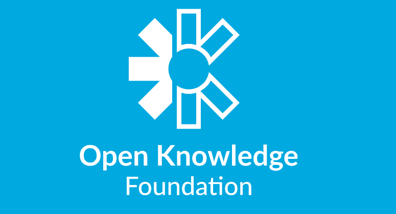
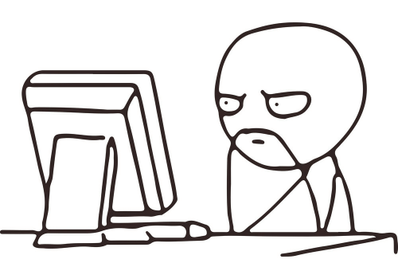

```{r setup, include=FALSE}
knitr::opts_chunk$set(echo = FALSE)
```

## Contents

- Brief presentation
- Practical
  - Direct downloads
  - API
  - API wrapper
  - Scraping
- Q&A

---

## What is open data?

- Availablity and access
  - Cost
  - Machine-readable
- Re-use and redistribution
  - Free use
  - Modification
  - Redistribution
- Universal participation
  - (Non)commercial

<br>

<center>

```{r okf, out.width="300px"}

```

</center>

---

## Thinking open

- Strengths
  - Open research
  - Accessibility
  - Reproducibility
  - Organic (sometimes)
- Limitations
  - Skills
  - Licences
  - Bias (generalisability)
- Being critical


<center>

```{r thinking, out.width="300px"}

```

</center>


---

## Practical

- Direct downloads
  - Rijkswaterstaat
  - Repository
- API
  - Transport for London
- API wrapper
  - CBS
- Scraping
  - Drimble/P2000

<center>

```{r logo, out.width="200px"}

```

</center>

---

## Thanks for listening!

<br>

<br>

<center>

Samuel Langton <br> <br>

slangton@nscr.nl <br> <br>

www.samlangton.info <br> <br>

@sh_langton <br> <br> <br>

